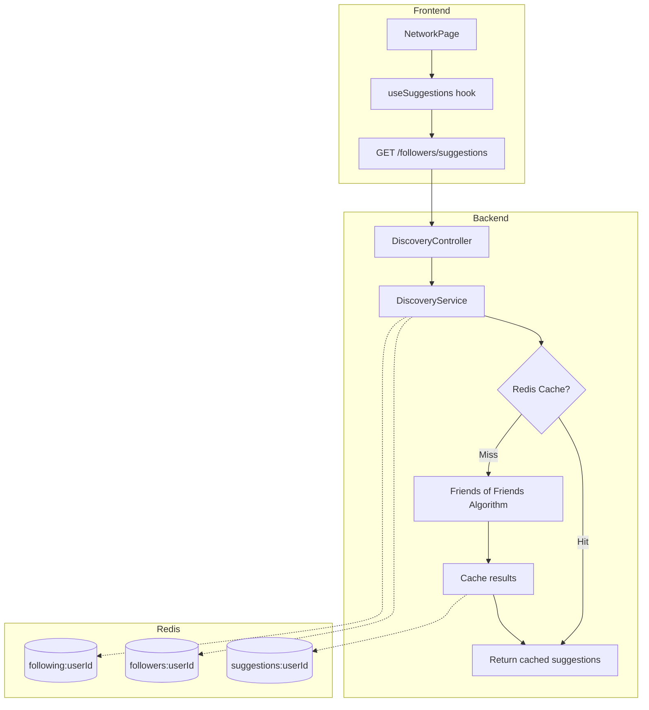

# People Discovery System

Technical documentation for the "People You May Know" feature.

## Overview

The discovery system suggests users to follow based on mutual connections using a **Friends of Friends** algorithm. It's designed for scalability up to ~1M users using Redis caching.

## Architecture



## Algorithm: Friends of Friends

### How It Works

1. **Get user's following list** from Redis (or DB on cache miss)
2. **For each followed user**, get who _they_ follow
3. **Count candidates** - users appear more often = stronger signal
4. **Filter out** self and already-following
5. **Sort by mutual count** and return top N
6. **Cache results** for 6 hours

### Example

```
User A follows: [B, C, D]

B follows: [E, F, G]
C follows: [E, H]
D follows: [E, F, I]

Candidate counts:
  E: 3 (appears in B, C, D's lists)
  F: 2 (appears in B, D's lists)
  G: 1
  H: 1
  I: 1

Suggestions for A: [E, F, G, H, I] (sorted by mutual count)
```

## Redis Data Structures

| Key Pattern            | Type | TTL | Purpose                           |
| ---------------------- | ---- | --- | --------------------------------- |
| `following:{userId}`   | Set  | 24h | IDs of users this user follows    |
| `followers:{userId}`   | Set  | 24h | IDs of users who follow this user |
| `suggestions:{userId}` | List | 6h  | Pre-computed suggestion IDs       |

### Write-Through Caching

On every follow/unfollow action, Redis is updated immediately:

```typescript
// In FollowersService
await follow.mutateAsync(userId);
// FollowCacheService updates:
// - SADD following:{currentUser} userId
// - SADD followers:{userId} currentUser
```

## Key Files

### Backend

| File                                    | Purpose                               |
| --------------------------------------- | ------------------------------------- |
| `src/followers/discovery.service.ts`    | Core algorithm implementation         |
| `src/followers/discovery.controller.ts` | `GET /followers/suggestions` endpoint |
| `src/followers/follow-cache.service.ts` | Redis operations for follow graph     |
| `src/followers/followers.service.ts`    | Follow/unfollow with cache updates    |

### Frontend

| File                                                        | Purpose                             |
| ----------------------------------------------------------- | ----------------------------------- |
| `src/features/social/api/network-api.ts`                    | API client                          |
| `src/features/social/hooks/use-network.ts`                  | React Query hook (`useSuggestions`) |
| `src/features/social/components/network/NetworkPage.tsx`    | UI with Discover tab                |
| `src/features/social/components/network/SuggestionCard.tsx` | User suggestion card                |

## API

### `GET /followers/suggestions`

Returns suggested users to follow.

**Query Parameters:**

- `limit` (optional, default: 20, max: 50)

**Response:**

```json
[
  {
    "id": "user-uuid",
    "name": "John Doe",
    "image": "https://...",
    "mutualCount": 5
  }
]
```

## Performance

| Operation             | Target | Method                        |
| --------------------- | ------ | ----------------------------- |
| Suggestions (cached)  | <50ms  | Redis LRANGE                  |
| Suggestions (compute) | <300ms | Redis SMEMBERS + DB hydration |
| Follow/Unfollow       | <100ms | DB + Redis SADD/SREM          |

## Scalability

| Users   | Strategy                                |
| ------- | --------------------------------------- |
| <100K   | Current Redis-based approach works well |
| 100K-1M | Add background job for pre-computation  |
| >1M     | Consider Neo4j or dedicated graph DB    |

### Limiting Explosion

To prevent performance issues with power users:

- Sample max 100 followed users for computation
- Cap suggestions list at 100 entries
- Use 6-hour TTL to amortize cost

## Fallback: Popular Users

For new users with no follows, the system falls back to showing **popular users** (sorted by follower count):

```sql
SELECT u.id, u.name, COUNT(f.id) as follower_count
FROM "user" u
LEFT JOIN follow f ON f."followingId" = u.id
WHERE u.id != $currentUserId
GROUP BY u.id
ORDER BY follower_count DESC
LIMIT 20
```
